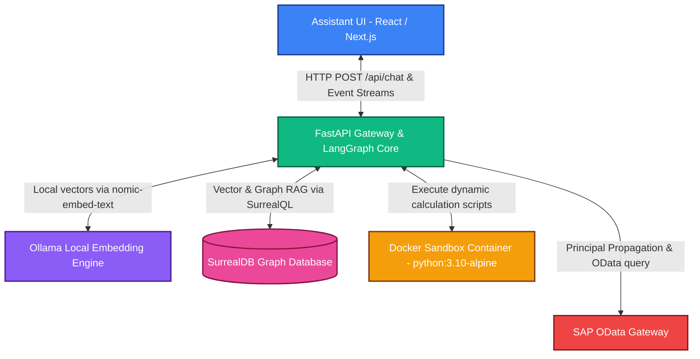

# 🚀 Enterprise SAP OData Chatbot — Setup & Installation Guide

This guide outlines the steps to build, configure, and run the intranet-bound enterprise AI chatbot. The system leverages local open-source components (**Ollama**, **SurrealDB**, **Docker**) and high-performance cloud intelligence (**Groq**) to securely query SAP OData service metadata and perform ephemeral calculations in sandboxed environments.

---

## 🏗️ System Architecture Overview



---

## 📋 System Prerequisites

Ensure you have the following software installed on your local host system:

*   **Docker & Docker Compose** (Required to spin up SurrealDB, Ollama, and isolated execution sandboxes)
*   **Python 3.10 or 3.11** (Backend execution layer)
*   **Node.js 18+ & npm** (Frontend rendering & dev execution)
*   **Groq API Key** (Access to ultra-fast inference models like `Llama-3.3-70b-versatile`)

---

## 🛠️ Step-by-Step Setup Instruction

### 1. Configure Environment Variables

The project contains environment templates that need to be initialized. 

Copy the backend configuration files into place:

```bash
# In the repository root directory:
cp .env.example .env
cp .env.example backend/.env

# In the frontend directory:
cp frontend/.env.local.example frontend/.env.local  # If template exists, or check port compatibility
```

Open the `.env` files in both the root and `backend` directory, and configure the variables:

*   **`GROQ_API_KEY`**: Paste your authentic Groq API key here (obtainable from [Groq Console](https://console.groq.com/)).
*   **`SURREAL_URL`**: Keep as `ws://localhost:8001/rpc` (our Docker port map matches this).
*   **`OLLAMA_BASE_URL`**: Keep as `http://localhost:11434` (the container interacts internally).

---

### 2. Launch Local Database & Embedding Services

The system bundles a `docker-compose.yml` that provisions SurrealDB (with persistent local volume mapping) and Ollama.

Start the stack in the background:

```bash
# Spin up SurrealDB and Ollama
docker compose up -d
```

#### 📥 Verify Local Vector Embeddings Node
Our orchestration pipeline maps raw query vectors using Ollama running `nomic-embed-text`. 

1. The docker setup automatically pulls `nomic-embed-text` during initial startup via the helper service `ollama-pull`.
2. Check that the service pulled the model successfully:

```bash
# Direct HTTP check to local Ollama daemon
curl http://localhost:11434/api/tags
```

*(Expected Output: JSON containing a representation of the `nomic-embed-text` model definition).*

---

### 3. Install & Start Backend (FastAPI + LangGraph)

The backend exposes the HTTP REST endpoint, manages the LangGraph agent state transitions, and streams Server-Sent Events (SSE) back to the UI.

#### Create Virtual Environment & Install Dependencies:
```bash
# Navigate to backend directory
cd backend

# Create a clean Python virtual environment
python3 -m venv venv

# Activate the virtual environment
source venv/bin/activate

# Install all package dependencies
pip install -r requirements.txt
```

#### 🗄️ Seed/Sync the Database:
We dynamically fetch SAP entities, relationships, and schemas directly from the SAP OData service metadata. Run the sync script to populate SurrealDB:

```bash
# Runs the dynamic OData sync script under the virtual env scope
python scripts/sync_odata.py
```

*(Successful output prints status messages about fetching, parsing XML, generating embeddings via Ollama, and upserting the entities/relationships into SurrealDB).*

#### 🚀 Launch Backend Engine:
```bash
# Spin up FastAPI application on port 8080
uvicorn app.main:app --reload --port 8080
```

*   **Swagger API Docs**: You can inspect routes and execute test calls in real-time by going to [http://localhost:8080/docs](http://localhost:8080/docs).
*   **Health Status API**: Open [http://localhost:8080/health](http://localhost:8080/health) to verify components are fully active.

---

### 4. Install & Start Frontend (Next.js + assistant-ui)

The frontend is a sleek interface featuring the modern `@assistant-ui/react` hook structures natively handling agent interactions, streaming buffers, and thread history.

Navigate to the frontend folder and install standard dependencies:

```bash
# Navigate to the frontend directory
cd ../frontend

# Install node dependencies
npm install
```

#### Run Next.js in Local Mode:
```bash
# Spin up development server on port 3030
npm run dev
```

*   Open [http://localhost:3030](http://localhost:3030) in your web browser.
*   The homepage features a sidebar showing threads loaded directly from SurrealDB and a main chat screen mapped to custom tool handlers!

---

## 🛠️ Verification & Troubleshooting Checklist

### 1. System Health Checklist
Make sure all of the following components are fully active and reachable:
- [ ] **Docker Containers**: Verify `sap-surrealdb` and `sap-ollama` containers are running (`docker ps`).
- [ ] **FastAPI Backend**: Confirm `/health` endpoint responds with Status: Healthy.
- [ ] **Next.js Port**: Confirm that the user interface loads properly on `http://localhost:3030`.
- [ ] **Groq Connectivity**: Ensure the system has valid credentials in `.env` to authenticate.

---

### 2. Common Errors and Resolutions

> [!WARNING]
> **SurrealDB Connection Failures**
> If your backend errors on startup with `SurrealDB not available`, ensure the docker-compose service is healthy:
> ```bash
> docker ps --filter name=sap-surrealdb
> ```
> If it's crashed or unreachable, check the logs: `docker logs sap-surrealdb`. Also double-check that port `8001` isn't already taken by an existing database on the host machine.

> [!IMPORTANT]
> **Ollama Embedding Node Missing**
> If queries fail in the vector embedding node step, Ollama might not have downloaded the weights. Check if `nomic-embed-text` is loaded:
> ```bash
> docker exec -it sap-ollama ollama list
> ```
> If it's missing, pull it manually:
> ```bash
> docker exec -it sap-ollama ollama pull nomic-embed-text
> ```

> [!CAUTION]
> **Docker Calculation Sandbox Issues**
> For complex calculation steps, LangGraph spawns isolated alpine docker containers. Ensure your user has permissions to run docker commands without `sudo` (e.g. is added to the `docker` user group). If docker is not available, you can temporarily set `USE_DOCKER=false` in `.env` to execute calculations in host subprocesses (note that this is for non-production development environments only).

---

## 🤝 Code Sandbox MCP & SurrealDB MCP Independent Execution

If you wish to run the custom stdio-based MCP servers independently to link with other clients (e.g., Claude Desktop, Cursor), you can execute them directly over standard I/O:

```bash
# SurrealDB MCP Server
export SURREAL_URL="http://localhost:8001"
python mcp_servers/surreal_mcp/server.py

# Code Sandbox MCP Server
python mcp_servers/sandbox_mcp/server.py
```
